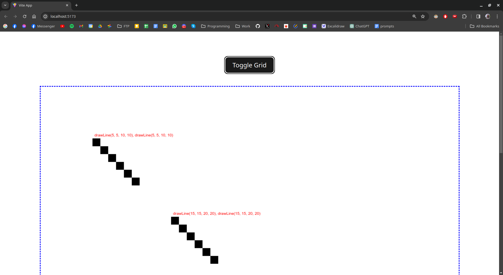
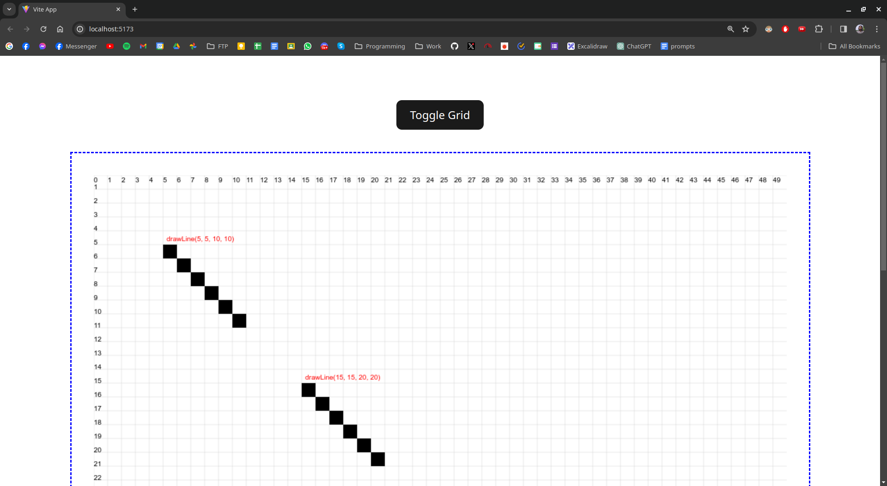
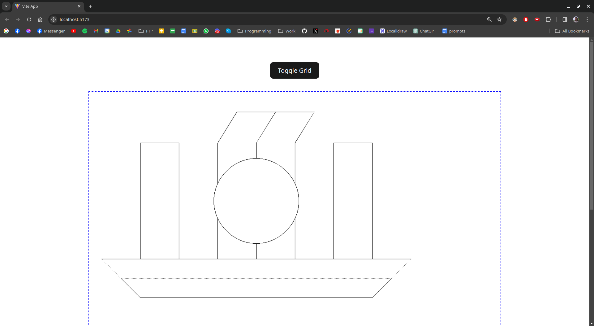

# Computer Graphics Algorithms

This is a Javascript project with Vite that allows you to add algorithms and render pixels. The primary objective is to implement `Computer Graphics Algorithms` in Javascript.

## Getting Started

These instructions will get you a copy of the project up and running on your local machine for development and testing purposes.

### Prerequisites

You need to have [Node.js](https://nodejs.org/) and [npm](https://www.npmjs.com/) installed on your machine.

### Installation

1. Clone the repo
   ```sh
   git clone https://github.com/anindosarker/computer-graphics-algorithms-javascript.git
   ```
2. Install NPM packages
   ```sh
   npm install
   ```

### Running the project

This project uses Vite for its build system. To run the project, use the following command:

```sh
 npm run dev
```

Then go to [http://localhost:5173/](http://localhost:5173/) to view the project.

## Usage

### Folder Structure

        .
        ├── js
        │   ├── algorithms          # Add your algorithms here
        │   │   ├── algorithm1.js
        │   │   ├── algorithm2.js
        │   │   └── algorithm3.js
        │   ├── config.js           # Config file
        │   ├── grid.js
        │   ├── utils.js            # Utility functions
        │   └── display.js          # Draw pixels here
        ├── index.html
        ├── main.js
        ├── style.css
        ├── package.json
        └── README.md

## Adding Algorithms

- Algorithms should be added in the `js/algorithms` folder.
- To render pixels, call the `setPixel(xCoordinate, yCoordinate)` method (imported from the `config.js` file).
- You can add a label to each function call to identify the algorithm. This is helpful if you render overlapping lines. For example:

```js
setLabel(x0, y0, `drawLine(${x0}, ${y0}, ${x1}, ${y1})`);
```

Here is an implmenetation of the drawLine algorithm:

```js
import { setLabel, setPixel } from "../config";

export function drawLine(x0, y0, x1, y1) {
  setLabel(x0, y0, `drawLine(${x0}, ${y0}, ${x1}, ${y1})`);

  const dx = Math.abs(x1 - x0);
  const dy = Math.abs(y1 - y0);
  const sx = x0 < x1 ? 1 : -1;
  const sy = y0 < y1 ? 1 : -1;

  let err = dx - dy;

  while (true) {
    setPixel(x0, y0);

    if (x0 === x1 && y0 === y1) {
      break;
    }

    const e2 = 2 * err;

    if (e2 > -dy) {
      err -= dy;
      x0 += sx;
    }

    if (e2 < dx) {
      err += dx;
      y0 += sy;
    }
  }
}
```

## Modifying the grid and pixel size

- You can modify how many pixels are rendered on the canvas by changing the `GRID_STEP` variable in the `config.js` file. The default value is 50.

- > **Note:** If you change the `GRID_STEP` value, it will affect the size of the pixels and the number of pixels that can be rendered on the canvas. For larger images, use a smaller value.

- You can toggle the grid off by clicking the `Toggle Grid` button.
  

## Drawing on the canvas

In the `display.js` file, call each algorithm with the coordinates and draw the pixels.
For example:
Drawing 2 lines with the drawLine Algorithm:

```js
import { drawLine } from "./algorithms/line";

export function displayDrawings() {
  drawLine(5, 5, 10, 10);
  drawLine(15, 15, 20, 20);
}
```



## Example of a complex drawing

For this example, some initial edits have been made.

- The grid has been turned off.
- The pixel size has been reduced to 10. `GRID_STEP = 10`
- Use `context.fillRect(x, y, 1, 1);` for drawing pixels instead of `context.fillRect(actualX, actualY, GRID_STEP, GRID_STEP);`

Modify these 3 lines in the `config.js` file:

```js
let GRID_STEP = 10; // --- CHANGE this value to 10 ---

export function setPixel(x, y) {
  // --- Comment this line ---
  // context.fillRect(actualX, actualY, GRID_STEP, GRID_STEP);

  // --- Uncomment this line ---
  context.fillRect(x, y, 1, 1);
}
```

- Then add the drawing in the `display.js` file:

```js
import { bresenhamCircle } from "./algorithms/bresenham-circle";
import { drawLine } from "./algorithms/line";
import { drawLineDashed } from "./algorithms/linedashed";

export function displayDrawings() {
  // Problem 1

  drawLine(0, 400, 800, 400); // ok
  drawLine(100, 500, 700, 500); //ok bottom line
  drawLineDashed(50, 450, 750, 450); //ok middle dash
  drawLineDashed(0, 400, 50, 450); //ok left dash
  drawLine(50, 450, 100, 500); //ok left line \
  drawLineDashed(800, 400, 750, 450); // ok right dash
  drawLine(750, 450, 700, 500); // ok right line /

  drawLine(100, 400, 100, 100); // |-
  drawLine(200, 400, 200, 100); // -|
  drawLine(100, 100, 200, 100); //

  drawLine(600, 400, 600, 100); // |-
  drawLine(700, 400, 700, 100); // - |
  drawLine(600, 100, 700, 100); //

  drawLine(300, 205, 300, 100); // |- -
  drawLine(300, 295, 300, 400); // |- -
  drawLine(400, 140, 400, 100); // - | -
  drawLine(400, 360, 400, 400); // - | -
  drawLine(500, 205, 500, 100); // - - |
  drawLine(500, 295, 500, 400); // - - |

  drawLine(350, 20, 550, 20); // ok ---
  drawLine(300, 100, 350, 20); // ok /-
  drawLine(500, 100, 550, 20); // ok
  drawLine(400, 100, 450, 20); // ok

  bresenhamCircle(400, 250, 110); // circle ok
}
```



## Contributing

Any contributions you make are greatly appreciated.

1. Fork the Project
2. Create your Feature Branch (`git checkout -b feature/AmazingFeature`)
3. Commit your Changes (`git commit -m 'Add some AmazingFeature'`)
4. Push to the Branch (`git push origin feature/AmazingFeature`)
5. Open a Pull Request

## License

Distributed under the MIT License.

## Contact

Anindo Sarker - [sarkeranindo@gmail.com](mailto:sarkeranindo@gmail.com)

Project Link: [https://github.com/anindosarker/computer-graphics-algorithms-javascript.git](https://github.com/anindosarker/computer-graphics-algorithms-javascript.git)
